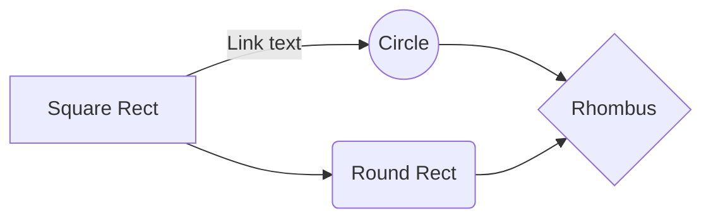

% Markdown으로 slideshow 만들기
% Sungsik Nam
% 2015-08-17

# 환경셋업

## pandoc 설치

* [Pandoc Homepage](http://pandoc.org/installing.html) 에서 Windows용 설치파일을 다운로드해서 설치.

# 문서작성

## 순서



## 프로젝트 복사

(작성중)


## 문서 수정

Yobi에서 문서 수정 가능.
(작성중)


## mardown file을 빌드

```
build_md_for_reveal.js.bat readme.md 
```

## 결과물 확인

* Chrome으로 readme.html 파일을 열어서 결과물 확인


## Push!

(작성중)

# reveal.js 간단한 소개

## 단축키

* ?: 단축키 보기
* ESC: 전체 맵 보기
* f: Full Screen
* .: Black Screen

## pdf로 저장하려면

* 경로 뒤에 ?print-pdf를 붙임
* e.g. .../doc-git-setting/repo_rules.html?print-pdf
* ctrl+p로 인쇄메뉴 진입해서 대상을 pdf로 셋팅해서 저장(Chrome에서만 확인됨).