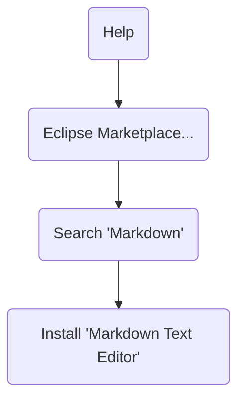
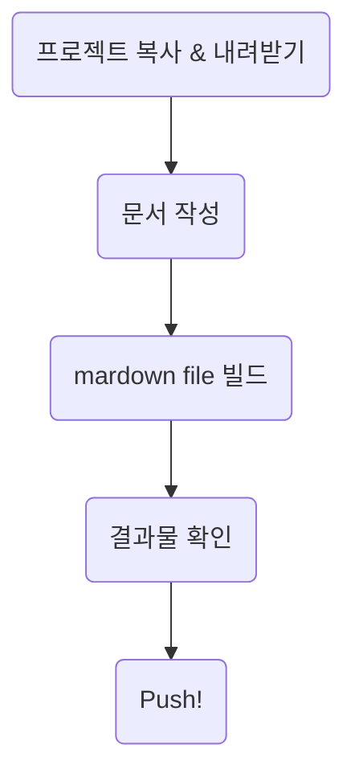
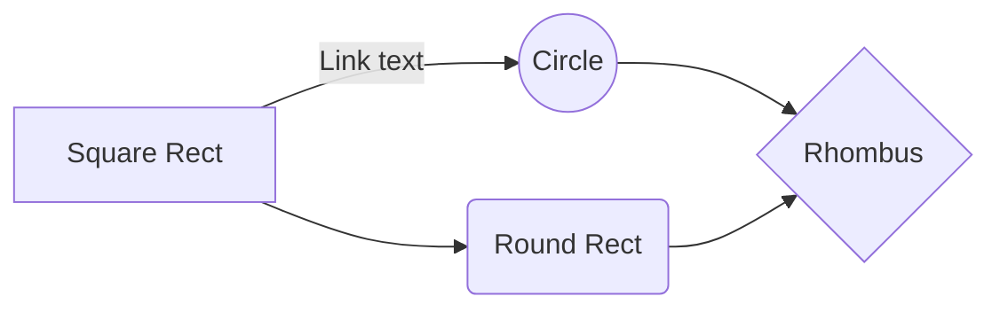
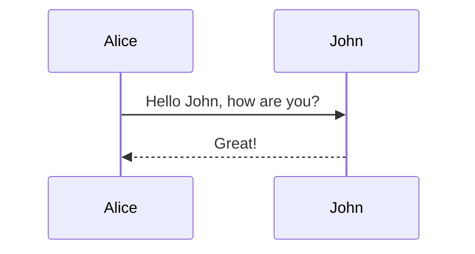
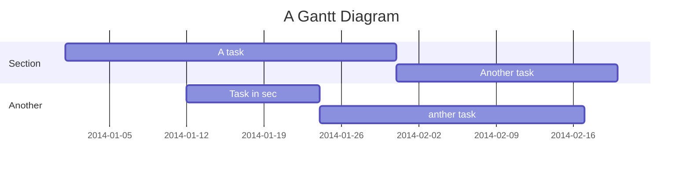

% Markdown으로 slideshow 만들기
% Sungsik Nam
% 2015-08-17

# 환경셋업

## pandoc 설치

* [Pandoc 홈페이지](http://pandoc.org/installing.html)에서 Windows용 설치파일을 다운로드해서 설치.


## Anaconda 설치

* [Continuum 홈페이지](http://continuum.io/downloads)에서 2.x용 설치파일을 다운로드해서 설치.


## Markdown 편집 Plug-in 설치




# 문서작성

## 순서



## 프로젝트 복사

* doc-git-setting project에서 "코드 저장소 복사" 클릭하고, eclipse에서 git clone!


## 문서 작성

```
# Title Slide (level 1)

## Slide (level 2)

* Bullet List 1
* Bullet List 2

## Slide (level 3)
...
```

## mardown file 빌드

* scripts folder에서 아래 내용 실행.
* __`../`에 주의!__

```
build_md_for_reveal.js.bat ../myfile.md 
```

## 결과물 확인

* Chrome으로 release folder에 생성된 html 파일을 열어서 결과물 확인.


## Push!

Yobi에 push!


# reveal.js 간단한 소개

## 단축키

* ?: 단축키 보기
* ESC: 전체 맵 보기
* f: Full Screen
* .: Black Screen

## pdf로 저장하려면

* 경로 뒤에 `?print-pdf`를 붙임
* e.g. `.../doc-git-setting/myfile.html?print-pdf`
* ctrl+p로 인쇄메뉴 진입해서 대상을 pdf로 셋팅해서 저장(Chrome에서만 확인됨).


# 글 쓰기 문법

## Markdown

* [Markdown 문법 가이드](http://scriptogr.am/myevan/post/markdown-syntax-guide-for-scriptogram)
* [Markdown 표준문서 번역](https://nolboo.github.io/blog/2013/09/07/john-gruber-markdown)

## Markdown for reveal.js

* [producing slide shows with pandoc](http://pandoc.org/README.html#producing-slide-shows-with-pandoc) 참조.
* 주의사항: __title slide(`#` 한개 붙인 title 아래)에 내용이 들어가면 정상적으로 build되지 않습니다!__

# Diagram & Flowchart 문법

## Flowchart

* [Flowchart 문법](http://knsv.github.io/mermaid/flowchart.html) 참조.

```
graph LR
    A[Square Rect] -- Link text --> B((Circle))
    A --> C(Round Rect)
    B --> D{Rhombus}
    C --> D
```



## Sequence Diagram

* [Sequence Diagram 문법](http://knsv.github.io/mermaid/sequenceDiagram.html) 참조.

```
sequenceDiagram
    Alice->>John: Hello John, how are you?
    John-->>Alice: Great!
```



## Gant diagram

* [Gant Diagram 문법](http://knsv.github.io/mermaid/gantt.html) 참조.

```
gantt
    title A Gantt Diagram

    section Section
    A task           :a1, 2014-01-01, 30d
    Another task     :after a1  , 20d
    section Another
    Task in sec      :2014-01-12  , 12d
    anther task      : 24d
```




# 마치며...

## TODO

* Web이랑 local이랑 다르게 보이는 현상 수정.
    * [mermaid plugin](https://github.com/ludwick/reveal.js-mermaid-plugin) 사용: 
        - 설치 방법: node.js, [bower](http://bower.io/)?
* title slide 배경, font type, font 크기 등 변경.
* li 등 일반 element에도 word-break 적용. header에 `<br />` 사용 시 word-break 이상하게 적용되는 문제 수정.
* 한글 글씨 한개가 줄내림되는 현상 수정.
* image 및 mermaid output 크기를 canvas 크기에 맞게 조절.
* mathjax test

## TODO 2

- [flowchart](http://adrai.github.io/flowchart.js/) - mermaid가 영 잘 안되면...

## Book formatting with CSS

- [Markdown Styles](http://mixu.net/markdown-styles/)
- [Designing for Print with CSS, 2015년](http://www.smashingmagazine.com/2015/01/designing-for-print-with-css/)
- [Building Books with css3, 2012년](http://alistapart.com/article/building-books-with-css3)
- [Printing a Book with CSS: Boom!, 2005년](http://alistapart.com/article/boom)

## Misc.

* Project setting: Eclipse Project 우클릭하고, Text file Encoding을 Other:UTF-8로 선택.
